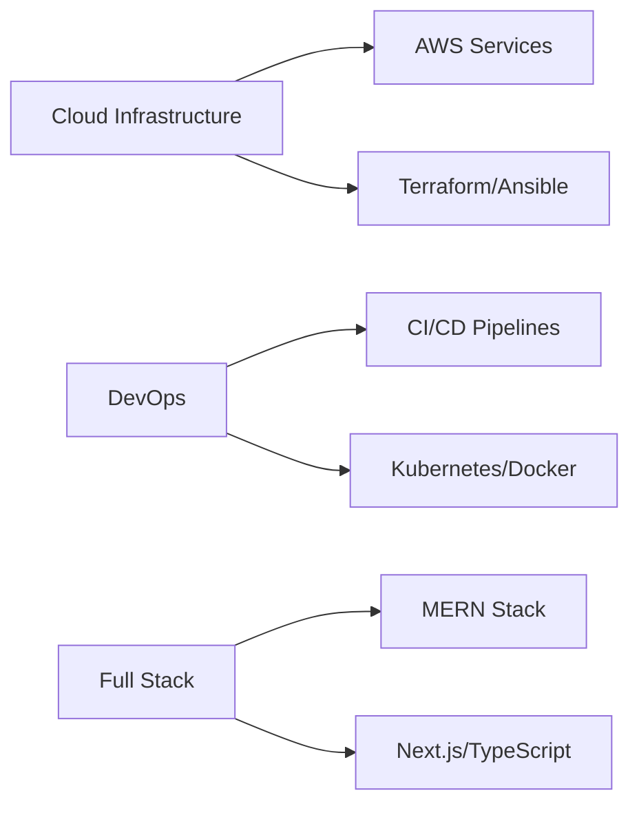
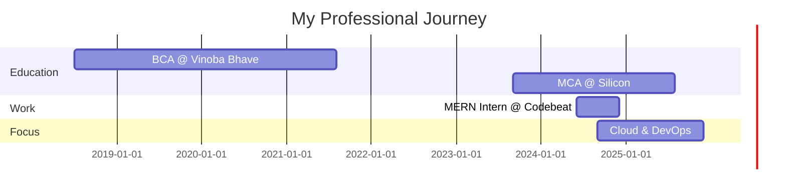

<div align="center">
  
  
  
  
  <br/>
  <br/>
  
  [](https://www.linkedin.com/in/aman-pushp-b1a501223/)
  [](https://amanpushp23.netlify.app/)
  [](mailto:amanpushp2001@gmail.com)
  [](https://github.com/AMANPUSHP23)
  
  <br/>
  
  
  
  
</div>

<br/>

---

## 👨‍💻 **About Me**

```yaml
Cloud & DevOps Engineer | MERN Stack Developer | MCA Student

🎓 Education:
  - Master of Computer Application (MCA) @ Silicon University (2023-2025)
  - Bachelor of Computer Application (BCA) @ Vinoba Bhave University (2018-2021)

💼 Experience:
  - MERN Stack Developer Intern @ Codebeat, Bhubaneswar (Jun 2024 - Dec 2024)

🌍 Location: Bangalore, Karnataka, India

🔭 Current Focus:
  - Building cloud infrastructure with AWS (EC2, S3, Lambda, RDS, CloudFront, Route 53)
  - Automating deployments with CI/CD pipelines (Jenkins, GitHub Actions)
  - Container orchestration with Kubernetes & Docker
  - Infrastructure as Code with Terraform & Ansible

🌱 Expertise:
  - Cloud Platforms: AWS (17+ services)
  - DevOps Tools: Docker, Kubernetes, Jenkins, Terraform, Ansible, Helm
  - Backend: Node.js, Express.js, Python
  - Frontend: React.js, Next.js, TypeScript
  - Databases: MongoDB, MySQL, PostgreSQL
  - Monitoring: Prometheus, Grafana, CloudWatch

💬 Ask me about: AWS, Kubernetes, Docker, CI/CD, MERN Stack, DevOps Best Practices

⚡ Fun fact: I can debug production issues faster than I can make coffee! ☕
```

---

## 🛠️ **Tech Stack & Tools**

<div align="center">

### ☁️ **Cloud & DevOps**


### 💻 **Frontend Development**


### 🔧 **Backend Development**


### 🗄️ **Databases**


### 🛠️ **Tools & Platforms**


</div>

---

## 📊 **GitHub Stats**

<div align="center">
  
  
  
  
  <br/>
  <br/>
  
  [](https://git.io/streak-stats)
  
  <br/>
  
  

</div>

---

## ☁️ **AWS Services Expertise**

<div align="center">

### Compute & Networking


### Storage & Database


### Security & Monitoring


### DevOps & IaC


**Total AWS Services:** 17+ | **Certification Goal:** AWS Solutions Architect Associate (2025)

</div>

---

## 🚀 **Featured Projects**

### ☁️ **Cloud & DevOps Projects**

<table>
<tr>
<td width="50%">

#### 🔧 VProfile AWS Deployment
[](https://github.com/AMANPUSHP23/vprofile-project-awsliftandshift.git)

Deployed multi-tier web application on AWS using EC2, ALB, Auto Scaling, Route 53, integrating MySQL, Memcached, RabbitMQ, and Tomcat. Implemented artifact deployment with Maven → S3, ensuring HTTPS security and high availability.

**Tech:** AWS, EC2, S3, ALB, Auto Scaling, Route 53, MySQL, Maven

</td>
<td width="50%">

#### ⚙️ CI/CD Pipeline with Jenkins
[](https://github.com/AMANPUSHP23/cicd-jenkins-pipeline)

Built end-to-end CI/CD pipeline using Jenkins, Docker, and GitHub Actions. Automated testing, building, and deployment to AWS EC2 with rollback capabilities.

**Tech:** Jenkins, Docker, GitHub Actions, AWS, CI/CD

</td>
</tr>

<tr>
<td width="50%">

#### 🐳 Kubernetes Microservices
[](https://github.com/AMANPUSHP23/k8s-microservices)

Deployed microservices architecture on Kubernetes cluster. Implemented Helm charts, auto-scaling, monitoring with Prometheus/Grafana.

**Tech:** Kubernetes, Docker, Helm, Prometheus, Grafana

</td>
<td width="50%">

#### 📦 Docker App Deployment
[](https://github.com/AMANPUSHP23/docker-app-deployment)

Containerized multi-tier application using Docker and Docker Compose. Optimized images with multi-stage builds for production.

**Tech:** Docker, Docker Compose, Nginx

</td>
</tr>
</table>

### 💻 **MERN Stack Projects**

<table>
<tr>
<td width="50%">

#### 📱 RoutineZen
[](https://routinezen.netlify.app/)
[](https://github.com/AMANPUSHP23/RoutineZen.git)

A futuristic web app for tracking daily routines with sleek design and smooth animations.

**Tech:** React, Node.js, MongoDB, Express.js

</td>
<td width="50%">

#### 🤖 AI-Planner Dashboard
[](https://ai-planner-app.netlify.app/)
[](https://github.com/AMANPUSHP23/AI-planner.git)

AI-powered dashboard merging automation, sleek UI, and real-time interactions for social media strategy.

**Tech:** React, Node.js, MongoDB, Express.js, Socket.io

</td>
</tr>

<tr>
<td width="50%">

#### 🏠 PushpSetu
[](https://pushp-setu.netlify.app/)
[](https://github.com/AMANPUSHP23/Pushp-Setu.git)

House Management System for tracking chores, managing expenses, and organizing inventory.

**Tech:** React, Node.js, MongoDB, Express.js, JWT

</td>
<td width="50%">

#### 🩸 Lifeline Blood System
[](https://lifeline-blood-system.netlify.app/)
[](https://github.com/AMANPUSHP23/LifeLine-Blood-System.git)

Blood Bank Management System connecting donors, recipients, and hospitals in real-time.

**Tech:** React, Node.js, MongoDB, Express.js, JWT

</td>
</tr>

<tr>
<td width="50%">

#### 💼 JobQuest
[](https://jobquesthunt.netlify.app/)
[](https://github.com/AMANPUSHP23/JobQuest.git)

Advanced job-hunting platform with user authentication, real-time listings, and smart filtering.

**Tech:** React, Node.js, MongoDB, Express.js

</td>
<td width="50%">

#### 🌐 Personal Portfolio
[](https://amanpushp23.netlify.app/)
[](https://github.com/AMANPUSHP23/portfolio-amanpushp.git)

Modern portfolio with smooth animations and responsive design.

**Tech:** React, TailwindCSS, Framer Motion

</td>
</tr>
</table>

[**View All Projects →**](https://amanpushp23.netlify.app/#projects)

---

## 🎯 **GitHub Trophies**

<div align="center">
  
[](https://github.com/ryo-ma/github-profile-trophy)

</div>

---

## 📈 **Current Focus & Goals**

<div align="center">



</div>

**2025 Goals:**
- 🎯 Obtain AWS Solutions Architect Associate Certification
- 🎯 Contribute to 5+ Open Source DevOps Projects
- 🎯 Build Production-Grade Cloud Infrastructure
- 🎯 Master Advanced Kubernetes & Service Mesh (Istio)
- 🎯 Secure Cloud & DevOps Engineer Role

---

## 💼 **Experience Timeline**



---

## 🌐 **Connect & Collaborate**

<div align="center">
  
[](https://www.linkedin.com/in/aman-pushp-b1a501223/)
[](https://amanpushp23.netlify.app/)
[](mailto:amanpushp2001@gmail.com)
[](https://github.com/AMANPUSHP23)
[](https://x.com/amanpushp23)

### 💬 Open to:
✅ **Cloud & DevOps Engineering Opportunities**  
✅ **Full-time & Internship Roles**  
✅ **Open Source Collaborations**  
✅ **Freelance DevOps Projects**  
✅ **Technical Discussions & Mentorship**

</div>

---

## 📫 **Get In Touch**

<div align="center">
  
**I'm actively seeking Cloud & DevOps Engineer opportunities!**  
If you have an exciting opportunity or want to collaborate, let's connect! 🚀

📧 **Email:** [amanpushp2001@gmail.com](mailto:amanpushp2001@gmail.com)  
💼 **LinkedIn:** [linkedin.com/in/aman-pushp-b1a501223](https://www.linkedin.com/in/aman-pushp-b1a501223/)  
🌐 **Portfolio:** [amanpushp23.netlify.app](https://amanpushp23.netlify.app/)  
📍 **Location:** Bangalore, Karnataka, India

</div>

---

<div align="center">
  <h2>⭐ Star this repo if you find it helpful! ⭐</h2>
  
  [](https://github.com/AMANPUSHP23)
  [](https://github.com/AMANPUSHP23)
  
  <br/>
  
  
  
  <br/>
  <br/>
  
  <h3>✨ Thanks for visiting! Keep building amazing things! ✨</h3>
  
  
</div>